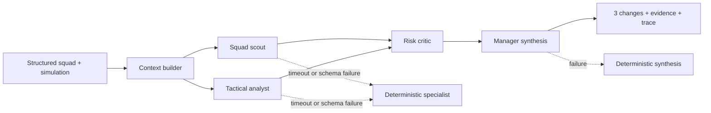

# UndefeatedXI

[Play the live game](https://www.undefeatedxi.com/) · Can your XI go 38-0-0?

UndefeatedXI is a shipped, mobile-first football-history draft and simulation platform built with React and TypeScript. Spin clubs, nations, and eras, draft legends into a real formation, then simulate whether the XI can chase 38-0-0, a perfect European run, or World Cup immortality.

The Agent Lab turns each completed simulation into a grounded multi-agent workflow: a scout and tactician inspect structured run data in parallel, a critic challenges their plan, and a manager produces three evidence-backed changes with an inspectable trace and rollback gate. Local deterministic agents keep it usable without an account or model key; signed-in runs can use OpenAI Structured Outputs through an authenticated, rate-limited Supabase Edge Function.

This is an independent fan project. It does not use official logos, crests, player photos, FIFA-style card art, paid football APIs, ad trackers, or data-selling cookies. Accounts, leaderboards, durable shared links, and model-backed agents are optional Supabase features; the core game and local agent evaluator work without them.

## Agent Lab



- Parallel specialist execution, strict JSON schemas, input/output validation, and bounded context
- Per-user rate limiting, server-only model secrets, request timeouts, one retry, and stage-level fallbacks
- Objective-sensitive plans for balance, attack, or resilience
- Five-stage traces, grounded confidence, evidence on every recommendation, and regression/rollback guardrails
- A repeatable six-case eval harness covering schemas, traces, evidence, objective sensitivity, and roster grounding

See [Agent Manager architecture](docs/agent-manager.md) and [agent evals](docs/agent-evals.md).

## Playable Scope

Public modes are gated by data validation. The current validated public set is:

- World XI
- Premier League
- Champions League
- World Cup
- Ball Knowledge
- LaLiga
- Serie A
- Bundesliga
- Ligue 1
- MLS
- European Cup
- Euros
- Copa America
- AFCON
- Club World Cup
- One-Club XI
- Nation XI
- Era Lock
- Chaos Mode
- Manager Mode

## Local Commands

```bash
npm install
npm run dev
npm test
npm run lint
npm run build
npm run agents:eval
```

Data and provenance commands:

```bash
npm run data:ratings
npm run data:generate
npm run data:coverage
npm run data:all
npm run data:audit
```

## Architecture

The app uses one shared engine with mode configs rather than separate games per competition.

- `src/data/modes.ts`: mode architecture, targets, roll dimensions, simulation format, public/preview status
- `src/data/formations.ts`: slot-first formations
- `src/data/playerContexts.ts`: generated source-backed contexts plus legacy references, with draft eligibility limited to sourced ratings
- `src/engine/draft.ts`: slot draft, rolls, rerolls, dead-roll protection
- `src/engine/eligibility.ts`: mode, team/nation, era, and position filtering
- `src/engine/chemistry.ts`: football-logic role balance
- `src/engine/tactics.ts`: tactical identity and weaknesses
- `src/engine/simulation.ts`: domestic, UCL, World Cup, generic tournament, MLS, Chaos, and Manager simulations
- `src/engine/share.ts`: share text
- `src/services/shareLinks.ts`: Supabase shared-run links with local encoded URL fallback
- `src/engine/storage.ts`: localStorage preferences, recent runs, best records
- `src/engine/validation.ts`: mode coverage and dataset gates
- `src/agents/`: grounded context, deterministic multi-agent runtime, schemas, and eval fixtures
- `src/services/agentManager.ts`: cloud orchestration with validated local recovery
- `supabase/functions/agent-manager/`: authenticated model-backed orchestration and failure recovery

## Optional Supabase Features

The core game runs fully client-side. Add these browser-safe env vars only when you want guest auth, leaderboard submissions, feedback, durable public result links, and model-backed Agent Lab runs:

```bash
VITE_SUPABASE_URL=
VITE_SUPABASE_ANON_KEY=
```

Supabase SQL, auth config, and Edge Function source lives under `supabase/`. Never expose a service-role key in the frontend. Full setup is in [`docs/deploy-supabase-vercel.md`](docs/deploy-supabase-vercel.md).

Keep `OPENAI_API_KEY` server-side as a Supabase secret. The optional model defaults to `gpt-4.1-mini`; the local evaluator remains the fallback when the key, network, specialist, or manager stage is unavailable.

## Data Provenance

Playable draft contexts are generated locally from CSV rating snapshots joined to Wikidata membership facts. Legacy curated references remain in the repo for comparison/tests, but public draft pools require a sourced rating row.

- `sourceAudit.json`: source reachability and API summaries
- `normalizedSources.json`: small normalized public-source snapshots
- `ratingImportReport.json`: rating snapshot import counts, source-confidence counts, and high-profile roll samples
- `missingRatingsReport.json`: exact-roll gaps where local snapshots do not contain a source-backed rating
- `ratedContexts.ts`: generated typed module used by the app
- `contextProvenance.json`: source URLs, source types, confidence, and estimate notes for every context
- `playableContexts.json`: generated playable context export with ratings, role tags, confidence, and expanded provenance
- `coverageReport.json`: validation coverage for all public and preview modes

Primary public references:

- OpenFootball players: `https://github.com/openfootball/players`
- OpenFootball football.json: `https://github.com/openfootball/football.json`
- Wikidata SPARQL: `https://www.wikidata.org/wiki/Wikidata:SPARQL_query_service/en-gb`
- Football-Data CSVs: `https://www.football-data.co.uk/data`
- StatsBomb open data: `https://github.com/statsbomb/open-data`
- EA/SoFIFA CSV snapshot: `https://www.kaggle.com/datasets/stefanoleone992/ea-sports-fc-24-complete-player-dataset`
- FIFA 10-20 FUT CSV snapshot: `https://www.kaggle.com/datasets/mohammedessam97/fifa-1020-fut-players-dataset`

Ratings use sourced EA/FIFA-style attributes where available. Normal club/team and national-team contexts use base sourced rows; Icon/Legend fallback is only admitted from rows explicitly marked Icon or Legend. Unmatched players are excluded from public draft pools and reported in `missingRatingsReport.json`.

## Release Gate

Before handoff or deploy:

```bash
npm run data:ratings
npm run data:generate
npm run data:coverage
npm run agents:eval
npm test
npm run lint
npm run build
```

Public navigation should only promote modes that pass strict validation. Preview modes may appear as engine demos when the shared loop is playable but strict context coverage is not complete.
